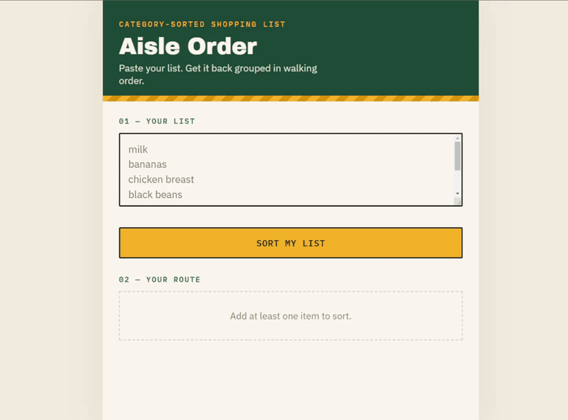

# 🛒 Grocery List Organizer

> An AI-powered grocery list organizer that sorts shopping lists into store departments in the order you'd actually walk through a store. Common items are categorized instantly by a local keyword system, while unfamiliar items are classified by Claude and cached so the same item is never sent to the API twice.

---

# Demo



---

# Technical Highlights

- **Hybrid local + Claude AI categorization** — a keyword dictionary resolves common items instantly and for free; Claude is only consulted for items it can't classify.
- **Batched API requests** — every unrecognized item from a single "Sort" click is sent in one request, not one per item, cutting both latency and cost.
- **Browser-side caching** — classified items are stored in `localStorage`, so no item is ever sent to the API twice.
- **Secure Cloudflare Worker proxy** — the Anthropic API key lives only as a Worker secret and never touches the browser.
- **Graceful fallback** — if the Worker or the API is unreachable, unresolved items simply fall back to "Uncategorized" instead of breaking the app.
- **Lightweight frontend** — vanilla HTML/CSS/JS, no framework, build step, or database.
- **Zero API calls for recognized items** — the local dictionary handles the majority of everyday groceries without ever touching the network.

---

# Why AI?

A local keyword dictionary is fast and free, but grocery items are effectively unbounded — no fixed list can keep up with every brand name, regional term, or unusual product a user might type. Maintaining a keyword list large enough to cover all of them would be impractical to build and a chore to maintain.

Rather than go that route, this project calls Claude only when the local system genuinely can't determine a category. When that happens, every unknown item from a single sort is batched into one request instead of sent individually, and the result is cached in the browser so that item never needs to be classified again.

The result is an architecture that minimizes both latency and API cost while still using AI exactly where it adds value — as a fallback for the long tail of items a static dictionary can't cover, not as a blanket solution applied to everything.

---

# Overview

Shopping with a randomly ordered list wastes time — produce, dairy, frozen, and household items end up scattered throughout the list, forcing repeated backtracking through the store.

Grocery List Organizer solves this by taking a pasted list and sorting it into the order most stores are laid out: produce and bakery first, frozen and household toward the end. It started as a simple personal frustration — every list I wrote became disorganized the moment I actually started shopping — and grew into an exploration of how to pair a fast, deterministic system with AI used only where it's actually needed.

---

# Features

- **Automatic department sorting** — paste a list, get it grouped into store departments in walking order: Produce, Bakery, Deli & Prepared, Meat & Seafood, Dairy & Eggs, Frozen, Pantry, Household & Paper, Checkout, and Uncategorized for anything unresolved.
- **Hybrid categorization** — instant local keyword matching backed by Claude AI for anything the dictionary doesn't recognize. See [Architecture](#architecture).
- **Check-off shopping** — check items off as you shop; edit the list and re-sort at any time.
- **Zero-install, zero-account** — runs entirely in the browser, no downloads or sign-up required. Local sorting works fully offline; AI categorization needs a network connection to reach the Worker.

---

# Architecture

```
User enters grocery list
        │
        ▼
Local keyword categorization
        │
        ▼
      Unknown?
        │
       Yes
        │
        ▼
   Browser cache
        │
        ▼
Claude API (Cloudflare Worker)
        │
        ▼
 Cache result locally
        │
        ▼
Future requests use cache
```

1. **User enters grocery list** — items are typed or pasted into the textarea, one per line.
2. **Local keyword categorization** — each item is checked against a built-in keyword dictionary in `index.html`. Matches resolve instantly, for free, with no network call.
3. **Unknown?** — anything the dictionary can't confidently place is treated as unresolved.
4. **Browser cache** — unresolved items are checked against a `localStorage` cache of previously-classified items before anything is sent over the network.
5. **Claude API (Cloudflare Worker)** — items still unresolved are batched into a single request to a Cloudflare Worker, which holds the Anthropic API key server-side and calls Claude Haiku.
6. **Cache result locally** — Claude's classifications are written back into the `localStorage` cache.
7. **Future requests use cache** — the next time any of those items appear in a list, they resolve from cache — no API call required.

If the Worker or the API is unreachable at any point, unresolved items simply fall back to "Uncategorized" rather than breaking the app.

---

# Technologies

**Frontend**
- HTML5
- CSS3
- Vanilla JavaScript (ES6) — no framework, no build step

**Backend**
- Cloudflare Workers — serverless proxy that holds the Anthropic API key
- Claude API (Haiku model) — classifies items the local dictionary doesn't recognize

The frontend is a single static file with no database. The only backend piece is a small Cloudflare Worker whose sole job is holding the API key server-side and forwarding batched classification requests — it's optional and only needed for AI-assisted categorization.

---

# AI Categorization Setup

AI categorization runs through a Cloudflare Worker so the Anthropic API key is never exposed in the browser. This is the only part of the project that requires installation/deployment steps.

## 1. Install dependencies

```bash
npm install
```

## 2. Configure your API key for local development

```bash
cp .env.example .dev.vars
# then edit .dev.vars and paste your real key:
# ANTHROPIC_API_KEY=sk-ant-...
```

`.dev.vars` is gitignored and is what `wrangler dev` reads locally. Never commit a real key.

## 3. Run the Worker locally

```bash
npm run dev
```

This starts the Worker at `http://127.0.0.1:8787`, which matches the default `CATEGORIZE_ENDPOINT` already set in `index.html`. Open `index.html` directly in a browser to test end-to-end against the local Worker.

## 4. Set the production secret

```bash
npx wrangler login
npm run secret:put
```

This prompts for the key and stores it as an encrypted Worker secret — it is never written to disk or committed.

## 5. Deploy the Worker

```bash
npm run deploy
```

Wrangler prints your Worker's URL (e.g. `https://aisle-order-proxy.<your-subdomain>.workers.dev`). Update `CATEGORIZE_ENDPOINT` near the top of the `<script>` block in `index.html` to `https://aisle-order-proxy.<your-subdomain>.workers.dev/categorize`, then host `index.html` wherever you like (it's still a static file).

## 6. Test it

- Sort a list of only common items (e.g. "milk, bananas, bread") — no network request should fire; everything resolves via the local keyword dictionary.
- Add an unusual item (e.g. "kombucha") and sort — the button should briefly show a "Checking 1 unfamiliar item with Claude…" loading state, then render the result.
- Sort the same list again — no request should fire for "kombucha" this time; it's now served from the `localStorage` cache.
- Stop the Worker (or point `CATEGORIZE_ENDPOINT` at a bad URL) and sort a list with an unknown item — it should still render, with that item landing in "Uncategorized" instead of the page breaking.

---

# Installation

Clone the repository:

```bash
git clone https://github.com/prestonross979/grocery-list-organizer.git
```

Open `index.html` in any modern web browser.

No installation or external dependencies are required for local keyword-based sorting.

To enable AI-assisted categorization for items the local dictionary doesn't recognize, see [AI Categorization Setup](#ai-categorization-setup).

---

# Roadmap

This project is under active development — completed phases are marked below.

## Phase 1 — Core Application ✅

- [x] Grocery list creation
- [x] Automatic department sorting
- [x] Responsive interface
- [x] Item management
- [x] Department organization

## Phase 2 — Smarter Categorization

- [x] AI-assisted categorization for items the local dictionary doesn't recognize (via Claude API + Cloudflare Worker)
- [ ] Expanded grocery database
- [ ] Better keyword recognition
- [ ] Multiple category suggestions
- [ ] Custom department assignments
- [ ] User-defined categories

## Phase 3 — Shared Shopping Lists

- [ ] Family accounts
- [ ] Shared shopping lists
- [ ] Real-time synchronization
- [ ] Item completion tracking
- [ ] Shopping collaboration

## Phase 4 — Shopping Intelligence

- [ ] Frequently purchased items
- [ ] Favorite products
- [ ] Shopping history
- [ ] Recently purchased items
- [ ] Purchase suggestions

## Phase 5 — Store Support

- [ ] Store-specific aisle layouts
- [ ] Custom aisle ordering
- [ ] Multiple saved stores
- [ ] Walmart layouts
- [ ] Costco layouts
- [ ] Target layouts
- [ ] H-E-B layouts
- [ ] Kroger layouts

## Phase 6 — AI Integration

Future versions may include an AI shopping assistant capable of:

- Building grocery lists from recipes
- Suggesting missing ingredients
- Meal-planning assistance
- Pantry management
- Shopping optimization
- Ingredient substitutions
- Nutrition recommendations
- Budget-conscious shopping suggestions

## Phase 7 — Mobile Applications

- [ ] Android application
- [ ] iPhone application
- [ ] Offline synchronization
- [ ] Voice item entry
- [ ] Barcode scanning
- [ ] Camera-based receipt scanning

## Phase 8 — Premium Features

- [ ] Cloud synchronization
- [ ] User accounts
- [ ] Cross-device support
- [ ] Household management
- [ ] Grocery spending analytics
- [ ] Shopping trends
- [ ] Budget tracking

## Potential Future Ideas

- Apple Reminders integration
- Google Tasks synchronization
- Alexa integration
- Siri shortcuts
- Google Assistant support
- Wear OS support
- Apple Watch companion app
- Smart recipe imports
- Automatic coupon matching
- Price comparison between stores
- Loyalty card integration
- Dark mode
- Accessibility improvements

---

# Long-Term Vision

The long-term vision is to evolve Grocery List Organizer into a complete shopping companion capable of organizing grocery trips from start to finish.

Future versions may combine intelligent grocery organization, AI-assisted meal planning, pantry management, budgeting tools, and real-time collaboration to create a seamless shopping experience for individuals and families.

The goal is not simply to replace a paper shopping list, but to build a smarter system that saves users time, reduces unnecessary effort, and improves everyday routines.
